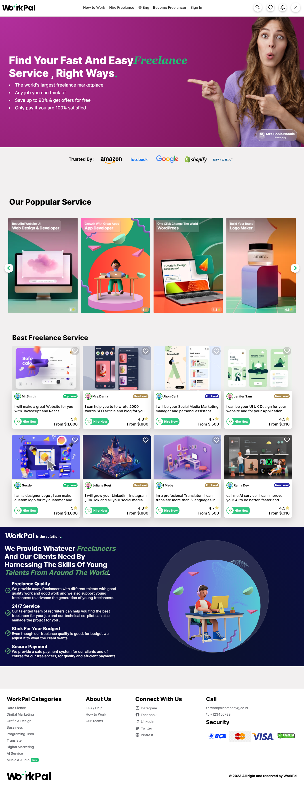
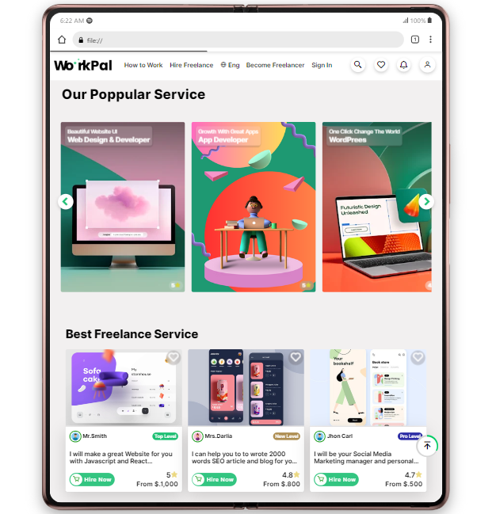
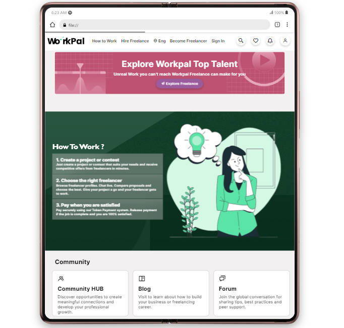
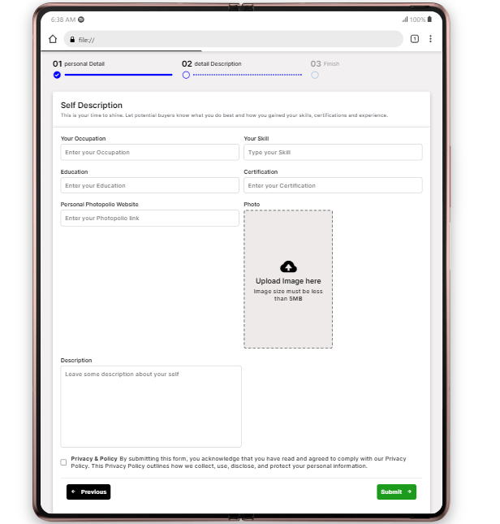
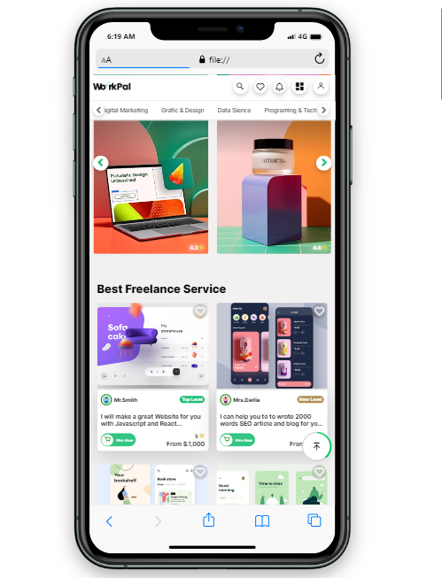
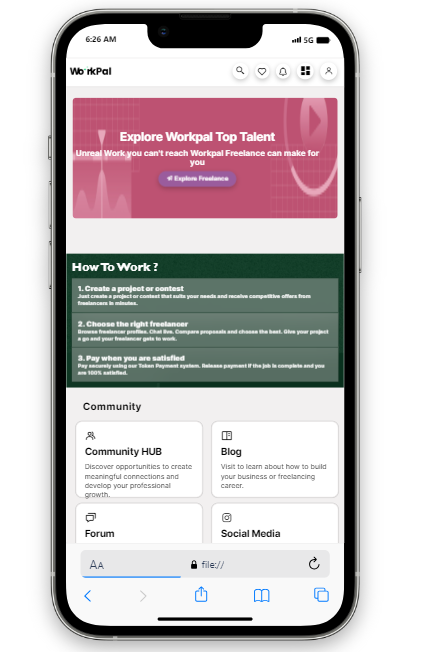
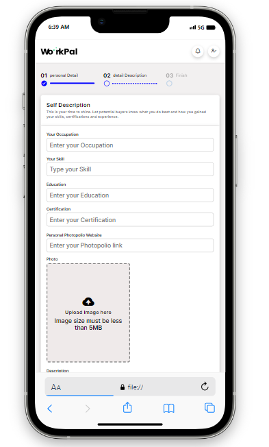

# WorkPal
is a platform independent that's make to which was created to employ young freelancers who are experienced in all fields such as Web Dev, Design, Mobile Dev, IOT, Cloud Computing. We also facilitate our freelancers and customers to be able to communicate with each other and be able to look for things that each other needs, that's why WorkPal was created.
to help more freelancers to get remote jobs any way and easily.


WORKPAL You're Happy We Make Money. ✨🎉


## Installation

```
USE GIT CLONE https:myrepolink.git
```


## Pages Interface
### All UI for Represent Pages 👇👀

<details>
  <summary>Desktop UI</summary>
  <p align="center">
    
    
    
  </p>
</details>

<details>
  <summary>Tab UI</summary>
  <p align="center">
    
    
    
  </p>
</details>

<details>
  <summary>Mobile UI</summary>
  <p align="center">
    
    
    
  </p>
</details>


